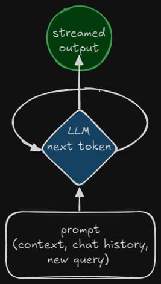

# 🧑‍💻👩‍💻 Prompt-Driven Development

  

...it doesn't have to be this way


## Ranked AI IDEs
| IDE         | Rules        | Custom Docs | Agents  | MCP    |
| ----------- | ------------ | ----------- | ------- | ------ |
| 🥇 Cursor   | ✅          | ✅          | ✅     | ✅     |
| 🥈 Windsurf | ✅          | ❌          | ✅     | ✅     |
| 🥉 Copilot  | ❔ Kinda    | ❌          | ✅ New | ✅ New | 


### 🧠 AI is only as Smart as you make it
- The more energy you put into a prompt, the farther it will go


### 💤 It's boring before it gets FUN
- Really think about what it is you want to build before you start
- Do the research
	- API docs, system flow charts, code samples, etc.
	- tech stack
	- examples
	- etc.
- Put on your Technical Product Manager hat


### 📝 Create a Statement of Work
- Work with AI Models to help generate a document that outlines your goals, as well as the implementation plan required to archive it.
- AI Models were trained on the web, they understand structured formats like `Markdown` and `XML`, use this to your advantage.
- Couple Example Prompts you can try (feel free to make them your own):  
	- [statement-of-work-prmopt](https://github.com/jparkerweb/ai-assistant-prompts/blob/main/planning/statement-of-work.md)
	- [planning-mode-prompt](https://github.com/jparkerweb/ai-assistant-prompts/blob/main/planning/mode-planning.md)


### 🧑‍⚖️ RULES
- Global Rules
	- general behavior and instructions across all projects  
      [My Global Rules](https://raw.githubusercontent.com/jparkerweb/ai-assistant-prompts/refs/heads/main/global_rules/global-rules.md)

- Project Rules
	- tech stack / project specific behaviors and instructions
	- `.cursorrules` / `.windsurfrules`
    - [Example Web Dev Project Rules](https://raw.githubusercontent.com/jparkerweb/ai-assistant-prompts/refs/heads/main/behavior_rules/behavior-web-dev.md)

##### 🧾 New VSCode Instuction for General Rules in Copilot (for those not using Cursor or Windsurf)
- [Global Rules config settings for Copilot](https://docs.github.com/en/copilot/customizing-copilot/adding-repository-custom-instructions-for-github-copilot)


### 🧪 Experiment with your own SOW / PRD Builders
- https://ai.dev
```bash
Help me write a prompt that I can give to an AI Model that will help me generate a details Statement of Work file (SOW.md).
I will provide a description of the product/functionality I want to build, the technology to be used, research documents, and other details.
The output should be a document that describes what is to be built and how; Including an implementation plan in one-point-story point stories in checkbox Markdown format (so they can be checked off as progress is made).
```

### 💬✏️ Modes & 🪟 Panes 
- Know when to just "chat" with your code and brainstorm ideas
- AI is available in other places than just that `sidebar` thingy
	- "*what's that special grep syntax again?*"...

### Tips
- `@` mention files, lines of code, terminal outputs, docs, URLs for context
- Use `git` and commit often!
- Review everything (become a `pull request` master)
- Start a new chat after major task completions (mind the `context window`)
- Don't be afraid to roll back and try again with a new prompt or model
- When you are stuck, have AI `add debug statements`
- Use your `voice` 🎙️(`win` + `H` on Windows / `func` key twice on Mac)


### 📚 Which Model should I use?
- Claude Sonnet is the best Coding Model
	- Sonnet 3.5 is great for beginners or when prompting without a ton of detail
	- Sonnet 3.7 is super smart, but requires a lot of guidance (it likes to go off and do its own thing)
- Gemini 2.5 Pro is an ok Coder, but better Planner


### ♻️ Auto Regressive LLMs

- An Auto-Regressive Large Language Model (LLM) generates text (including code) one piece (token) at a time.
- Each new token it predicts depends directly on the sequence of tokens it has already generated *before* it.
- Think of it like finishing a sentence: the next word you choose depends heavily on the words you've already written. This sequential, step-by-step prediction is the "auto-regressive" part.




### ⛓️ Chain of Draft
- The current LLMs used in IDEs are `auto regressive` (use this to your advantage)

Example "Chain of Draft" text I add to most of my Prompts:
```bash
Think step by step, but only keep a minimum draft for each thinking step, with 7 words at most.
Return the answer at the end of the response after a separator ####.
```

#### "Chain of Draft" Prompting Technique Explanation
1.  **`Think step by step`**: This encourages the LLM to break down the problem into smaller, sequential logical steps before generating the final code. It mimics a human thought process.
2.  **`but only keep a minimum draft for each thinking step, with 7 words at most`**: This is the key constraint. It forces the LLM to:
    *   **Summarize:** Condense the core idea of each reasoning step into a very brief phrase.
    *   **Focus:** Prioritize the most critical part of each step.
    *   **Structure Output:** Present its reasoning in a highly structured, concise, and easily scannable format.
3.  **`Return the answer at the end of the response after a separator ####`**: This clearly separates the final code output from the preceding reasoning steps.

**How this Technique Can Help Improve Coding Output Quality:**

*   **Forces Focused Reasoning:** The strict word limit per step prevents the LLM from rambling or getting lost in less relevant details during its thought process. It has to identify the *essence* of each step needed to solve the coding problem.
*   **Improved Traceability/Debugging:** If the final code is incorrect, you have a very concise, high-level "map" of the LLM's intended logic. This can make it much easier to pinpoint *where* the reasoning went wrong compared to wading through a long, unstructured explanation.
*   **Potential for Reduced Intermediate Errors:** By forcing conciseness, the model *might* be less likely to introduce errors within its reasoning steps themselves, as there's less room for verbose mistakes. However, it could also lead to oversimplification.
*   **Clear Separation:** The `####` separator ensures the final, usable code is distinct from the reasoning, making it easy to copy and use.

In essence, this technique uses constraints on the *intermediate reasoning output* to encourage a more structured, focused, and traceable thought process from the LLM, which can indirectly lead to better final code.


### 📄 Documentation & Inventory
AI is great at writing documentation, let it help you stay organized and look like a ⭐ Engineer; Remember, AI knows Markdown well 😂.

Example Prompt to create an `Inventory`:  
https://github.com/jparkerweb/ai-assistant-prompts/blob/main/inventory/mode-inventory.md


### 🧑‍🏫 Teaching Mode 
- AI IDE's can be a great way to learn new languages, patterns, and tech stacks
- Example Global Rules you can use:  
https://github.com/jparkerweb/ai-assistant-prompts/blob/main/behavior_rules/behavior-code-instructor.md


### 🫀 You `Life` is at stake
- AI is the fastest growing topic in technology
- AI isn't here to replace engineers, but rather transform how they interact and communicate with computers
- Engineers that don't embrace how to `speak AI` (prompt engineering) will be left behind


### 📦 Other Stuffs

- #### Google AI Studio:
	https://ai.dev  
	Use `Gemini 2.5 Pro` for free using the web interface above (it has a 1 million token context window). You can update docs to get summaries, work with the LLM to generate prompts you can use in your AI IDE, Dump in entire code bases and ask questions, Upload videos, etc...
- #### Github.gg
    https://github.gg/  
	Replace `.com` with `.gg` when on a GitHub repo to get access to a tool that will alow you to copy the entire codebase that you could then paste into a document or a LLM UI like Google AI Studio (see above).

- #### Awesome CursorRules
    https://github.com/PatrickJS/awesome-cursorrules  
	Collection of various `rules` related to different topics and technologies (great resource)

- #### MCP is the next big thing 💥
	Modle Context Protocol servers are being described as the `USB Port` for LLMs
    - Official Docs
        https://modelcontextprotocol.io/introduction
    - Awesome MCP Servers
        https://github.com/punkpeye/awesome-mcp-servers
	- My SQLite MPC Server
		https://github.com/jparkerweb/mcp-sqlite  
		please ⭐ my repo if you find it useful

- #### 🎲 My Repo of Rules & Prompts I us Daily 
	- [Collection of Rules by Justin](https://github.com/jparkerweb/ai-assistant-prompts)


### 🛡️ AI IDEs can be used for Security Hardening Too 
- Example Prompt:  
https://github.com/jparkerweb/ai-assistant-prompts/blob/main/security/mode-security.md

## Podcasts, Repos, YouTube channels and other random links
here are a few resource I use, search YouTube and Google (there are tons out there)

### Podcasts
- ThursdAI (my fav):  
	https://thursdai.news/
- Latent Space:  
	https://www.latent.space/podcast


### YouTube Videos / Channels
- Cursor AI `Tutorial for Beginners` (March 2025)  
    https://www.youtube.com/watch?v=3289vhOUdKA

- `Vibe Architecting`
	- A Structured "Vibe Coding" Flow (this is similar to the steps I tried to demo during our presentation)  
		https://www.youtube.com/watch?v=XY4sFxLmMvw
	- Here is Part 2 to the previous link (has links to a gist with the prompts in the descripiton)  
		https://www.youtube.com/watch?v=Mra9yodFKDY

		It will go through:  
		- brainstorming
		- product plan
		- ticket/task creation

	- I have created my own version of this here:  
		https://github.com/jparkerweb/ai-assistant-prompts/tree/main/vibe-architecting-flow
